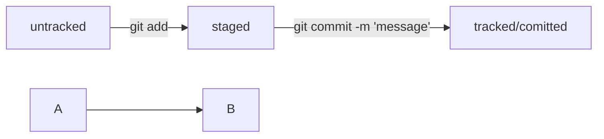

# Шпаргалка по Git  
---
## Установка Git  
---
### Mac  

```bash
brew install git
```

### Ubuntu  

*Git with Default Packages*  

### Windows  

[Download](https://git-scm.com/downloads)  

---

## Git version
```bash
git version 

```

## Git config
```bash
git config --global user.name "User Namovich" 
# имя или ник нужно написать латиницей и в кавычках  

git config --global user.email username@yandex.ru
# здесь нужно указать свой настоящий email

cat ~/.gitconfig

git config --list 

```

---

## Git init

```bash
cd ~/dev/first-project # перешли в нужную папку

git init

rm -rf .git # удалили подпапку .git если нужно "разгитить"

```

---

## Git status
```bash
git status

```

---

## Git add
```bash
git add . # добавить всю текущую папку
git add readme.txt # один файл
git add --all # подготовили к сохранению все файлы в репозитории

```

---

## Git commit
```bash
git commit -m 'Мой первый коммит!' 

```

---

## Git log
```bash
git log

git log --oneline
```

---

## Проверка наличия SSH-ключа
```bash
ls -la .ssh/ # вывели список созданных ключей 

```

---

## Инструкция по генерации SSH-ключа
```bash
ssh-keygen -t ed25519 -C "электронная почта, к которой привязан ваш аккаунт на GitHub"

ssh-keygen -t rsa -b 4096 -C "электронная почта, к которой привязан ваш аккаунт на GitHub"

```

---

## Копирование ключа в буфер обмена
### Mac / Linux
```bash
pbcopy < ~/.ssh/id_rsa.pub

```
### Windows
```bash
clip < ~/.ssh/id_rsa.pub

```

---

## Git remote add
```bash
git remote add origin git@github.com:%ИМЯ_АККАУНТА%/first-project.git 

```

---

## Git remote -v
```bash
git remote -v

```

---

## Отправить изменения на удалённый репозиторий
```bash
git push -u origin main # Первая отправка, если команда приведёт к ошибке, попробуйте заменить main на master. 

git push # далее можно просто push
```

---

## Словарь

* **HEAD** - ~синоним HASH последнего коммита~


